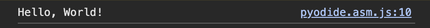
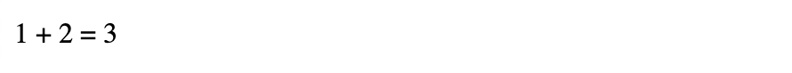
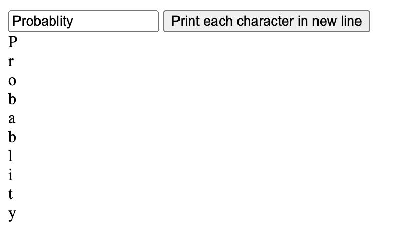
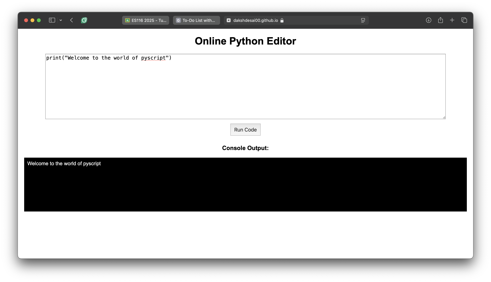
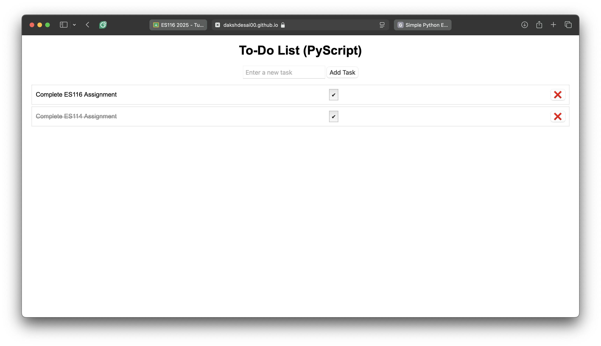

# Exploring PyScript for Interactive Web Apps and Frontend Development

## Introduction

PyScript is a tool that allows you to run Python codes directly in your web browser. It is built on top of WebAssembly and Pyodide, enabling Python to run efficiently in the browser without the need for a backend server. The main purpose of PyScript is to make web development more accessible to Python users. With PyScript, you can include Python code in an HTML file and use popular libraries like NumPy and Matplotlib for tasks such as data analysis and visualization without any complex setups.

## Installation & Setup

No actual installation is needed for PyScript. Just include PyScript in your HTML file using a CDN link. This is the basic setup:

1. Create an HTML file.
2. Include the PyScript library in the `<head>` section:

```html
<head>
  <link
    rel="stylesheet"
    href="https://pyscript.net/releases/2025.2.3/core.css"
  />
  <script
    type="module"
    src="https://pyscript.net/releases/2025.2.3/core.js"
  ></script>
</head>
```

3. And you're ready to start writing Python code in your HTML file.

## Key Features & Explanation

PyScript provides several key features:

- **Write Python directly in HTML**: Use the `<script type="py">` tag to execute Python code.
- **Use python only libraries in browser**: like NumPy, Pandas, and Matplotlib.
- **External Python Files**: Load and execute `.py` scripts from external sources.
- **Easy Integration with Web UI**: Use PyScript to manipulate the DOM and build interactive elements.

## Code Examples

### Simple Hello World

```html
<script type="py">
  print("Hello, World!")
</script>
```

This is a simple script that prints “Hello, World!” in browser console.



### Basic Variables and Showing Output

```html
<div id="basicMath"></div>
<script type="py">
  from pyscript import document
  a, b = 1, 2
  c = a + b
  document.getElementById("basicMath").innerText = f"{a} + {b} = {c}"
</script>
```

This code prints a simple output on the webpage. The `document` object allows Python to interact with the HTML DOM and update content dynamically.



### Basic User Input and Event Handling

```html
<input id="name" type="text" placeholder="Enter your name" />
<button py-click="printName">Submit</button>
<div id="output"></div>

<script type="py">
  from pyscript import document

  def printName():
      name = document.querySelector("#name").value
      document.getElementById("output").innerText = f"Hello, {name}!"
</script>
```

This code takes user input from a text field, processes it using PyScript, and dynamically displays a greeting message.


### Using External Files and Loops

```html
<input id="text" type="text" placeholder="Enter text" />
<button py-click="printEachChar">Submit</button>
<div id="output"></div>

<script type="py" src="./main.py"></script>
```

**`main.py` (External Script):**

```python

from pyscript import document

def printEachChar(event):
    input_text = document.querySelector("#string")
    english = input_text.value
    output_div = document.querySelector("#output")
    output_div.innerText = ""
    for c in english:
        output_div.innerText += c + "\n"
```

This code takes user input and prints each character on a new line using a loop.



### Complete Code

**`index.html`:**

```html
<!DOCTYPE html>
<html>
  <head>
    <meta charset="utf-8" />
    <meta name="viewport" content="width=device-width,initial-scale=1" />
    <title>Introduction and Basics of Pyscript</title>
    <link
      rel="stylesheet"
      href="https://pyscript.net/releases/2025.2.3/core.css"
    />
    <script
      type="module"
      src="https://pyscript.net/releases/2025.2.3/core.js"
    ></script>
  </head>

  <body>
    <h1>Introduction and Basics of Pyscript</h1>
    <!-- Basic Hello World -->
    <script type="py">
      print("Hello, World!")
    </script>
    <br />
    <!-- Basic variables and showing output-->
    <div id="basicMath"></div>
    <script type="py">
      from pyscript import document
      a = 1
      b = 2
      c = a + b
      print(f"{a} + {b} = {c}") # Output on console: 1 + 2 = 3
      document.getElementById("basicMath").innerText = f"{a} + {b} = {c}" # Output on webpage: 1 + 2 = 3
    </script>
    <br />
    <!-- Basic user input output using functions and event handlers-->
    <input type="text" id="name" placeholder="Enter your name:" />
    <button py-click="printName">Print Name</button>
    <!-- Triggers printName function -->
    <div id="greet"></div>
    <script type="py">
      def printName(event):
          name = document.querySelector("#name").value
          greet = f"Hello, {name}!"
          document.getElementById("greet").innerText = greet
    </script>
    <br />
    <!-- Using external files and loops -->
    <input type="text" id="string" placeholder="Type your string here..." />
    <button py-click="printEachChar">Print each character in new line</button>
    <div id="output"></div>
    <script type="py" src="./main.py"></script>
    <!-- Using main.py file and dependecies from pyscript.json -->
    <br />

    <h2>Some Basic Use Cases</h2>

    <!-- Basic Use Cases -->
    <h3>Check Even or Odd</h3>
    <input type="text" id="num" placeholder="Enter a number" />
    <button py-click="checkEvenOdd">Check Even or Odd</button>
    <div id="evenOdd"></div>
    <script type="py" src="./checkevenodd.py"></script>
    <br />
    <!-- Basic Use Cases -->
    <h3>Check Prime Number</h3>
    <input type="text" id="num-prime" placeholder="Enter a number" />
    <button py-click="checkPrime">Check Prime Number</button>
    <div id="prime"></div>
    <script type="py" src="./checkprime.py"></script>
    <br />
  </body>
</html>
```

**`main.py` (External Script):**

```python

from pyscript import document

def printEachChar(event):
    input_text = document.querySelector("#string")
    english = input_text.value
    output_div = document.querySelector("#output")
    output_div.innerText = ""
    for c in english:
        output_div.innerText += c + "\n"
```

**`checkprime.py` (External Script):**
```python
from pyscript import document

def isPrime(n):
    if n <= 1:
        return False
    for i in range(2, n):
        if n % i == 0:
            return False
    return True

def checkPrime(event):
    n = document.querySelector("#num-prime").value
    output_div = document.querySelector("#prime")
    if isPrime(int(n)):
        output_div.innerText = "Prime"
    else:
        output_div.innerText = "Not Prime"
    
```

**`checkevenodd.py` (External Script):**
```python
from pyscript import document

def checkEvenOdd(event):
    input_text = document.querySelector("#num")
    num = int(input_text.value)
    output_div = document.querySelector("#evenOdd")
    if num % 2 == 0:
        output_div.innerText = "Even"
    else:
        output_div.innerText = "Odd"
```

#### Demo Page Hosted on GitHub Pages [Example page](https://dakshdesai00.github.io/ES114-Assignments/Lab4/demo/)

## Use Cases

PyScript can be applied in various domains, including:

- **Interactive Dashboards**: Create real-time visualizations for analyzing data.
- **Educational Tools**: Teach Python programming directly in the browser without needing installations.
- **Prototyping Machine Learning Models**: Showcase ML models with interactive inputs.
- **Web-Based Simulations**: Create small physics, chemistry, or mechanical simulations.
- **Game Development**: Use Python instead of JavaScript for browser-based games.
- **Text Processing & NLP Applications**: Web-based tools for text analysis and translation.
- **Automated Form Processing**: Quick input validation, data manipulation, or automated responses.

### We have used PyScript to create a simple Python code editor in the browser and a Todo List application.  

- #### Python Code Editor:  
   [Python Code Editor](https://dakshdesai00.github.io/ES114-Assignments/Lab4/applications/python-editor/)  
   [Source Code](https://github.com/dakshdesai00/ES114-Assignments/blob/main/Lab4/applications/python-editor/index.html)  
     

- #### Todo List Application:  
   [Todo List Application](https://dakshdesai00.github.io/ES114-Assignments/Lab4/applications/todo-list/)  
   [Source Code](https://github.com/dakshdesai00/ES114-Assignments/blob/main/Lab4/applications/todo-list/index.html)  
     


## Conclusion

PyScript is a revolutionary concept that simplifies web development by allowing developers to write and execute Python code directly in the browser. It eliminates the need for backend servers in many applications and seamlessly integrates Python with HTML. Whether for data visualization, interactive applications, or educational tools, PyScript makes Python more accessible for web development.

Despite its benefits, PyScript has limitations:

- Running Python in the browser can be slower than native JavaScript.
- Not all Python libraries work seamlessly in PyScript.
- PyScript is still in development and may lack stability or advanced features.

As PyScript matures, we can expect improved performance, better library support, and more powerful capabilities.

## References & Further Reading
- [PyScript Documentation](https://docs.pyscript.net/2025.2.3/)
- [Python Documentation](https://docs.python.org/3/)
- [HTML Documentation](https://developer.mozilla.org/en-US/docs/Web/HTML)
- [WebAssembly](https://webassembly.org/)
- [Pyodide](https://pyodide.org/)